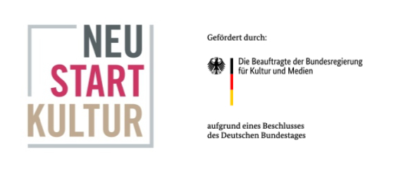

# Tablet AR-Anwendung: Masken der Welt

[TOC]

## Kurzbeschreibung

Die Tablet AR-Anwendung _Masken der Welt_ ist eine auf [A-Frame](https://aframe.io/) basierende AR-Webanwendung, mit der Besucherinnen verschiedene um einen Globus arrangierte Masken-Dioramen betrachten können. Die Anwendung ist für eine lokale Nutzung vor Ort im Ausstellungsbetrieb auf einem _Samsung Galaxy Tab S7_ konzipiert, grundsätzlich aber auch auf verschiedenen anderen Android Geräten zu nutzen. Eine Liste aller unterstützten Android Devices kann hier eingesehen werden: [ARCore supported devices](https://developers.google.com/ar/devices#google_play_devices).

## Förderhinweis

Diese Anwendung ist entstanden im Verbundprojekt museum4punkt0 – Digitale Strategien für das Museum der Zukunft. Das Projekt museum4punkt0 wird gefördert durch die Beauftragte der Bundesregierung für Kultur und Medien aufgrund eines Beschlusses des Deutschen Bundestages. Weitere Informationen: www.museum4punkt0.de

## Installation

### Hardware Voraussetzung:

Die Anwendung ist für eine lokale Nutzung vor Ort im Ausstellungsbetrieb auf einem _Samsung Galaxy Tab S7_ konzipiert, grundsätzlich aber auch auf verschiedenen anderen Android Geräten zu nutzen. Eine Liste aller unterstützten Android Devices kann hier eingesehen werden: [ARCore supported devices](https://developers.google.com/ar/devices#google_play_devices).

### Installation der Anwendung:

Der gesamte Inhalt des Repositorium muss auf einem lokalen Entwicklungsserver oder auf einem beliebigen online Server veröffentlicht werden. Die Webseite muss über eine verschlüsselte Verbindung aufgerufen werden (https).

### Browser:

Aktuell unterstützen nicht alle Browser die durch [A-Frame](https://aframe.io/) bereitgestellte [WebXR Api](https://www.w3.org/TR/webxr/). Die Anwendung wurde unter _Android 11_ in _Chrome Version 101.0.4951.61_ getestet.

## Benutzung

1. Auf dem Start Screen den Play Button mit einem Tap auslösen
2. Der AR-View (neues Fullscreen Fenster) öffnet sich. Die Kamera wird gestartet und ein Globus erscheint. Um den Globus sind verschiedene Masken Angeordnet.
3. Der Globus kann frei umgangen werden.
4. In der Mitte des Screens ist ein schwarzer Punk zu sehen. Mit Hilfe des Punktes können Masken ausgewählt werden. Dazu muss eine Maske mit dem Punk fokussiert werden. Der Punkt verfärbt sich rot und wird abwechselnd größer und kleiner. Nach kurzer Zeit vergrößert sich die Maske und es erscheint das dazugehörige Diorama und ein Textfeld.
5. Nach einer vordefinierten Zeit gehen Maske und Diorama wieder in ihre Ausgangsposition zurück. Nun können nacheinander weitere Masken betrachtet und ausgewählt werden.

## Credits

Konzept: Fasnachtsmuesum Schloss Langenstein

Software Entwicklung: [newObjects GmbH](https://new-objects.com/)

3D Assets: Daniel Boehme

## Lizenz

Der in diesem Repositorium veröffentlichte Code wird unter der MIT Lizenz veröffentlicht. Näheres siehe in der [Lizenz-Datei Code](./LICENSE).
